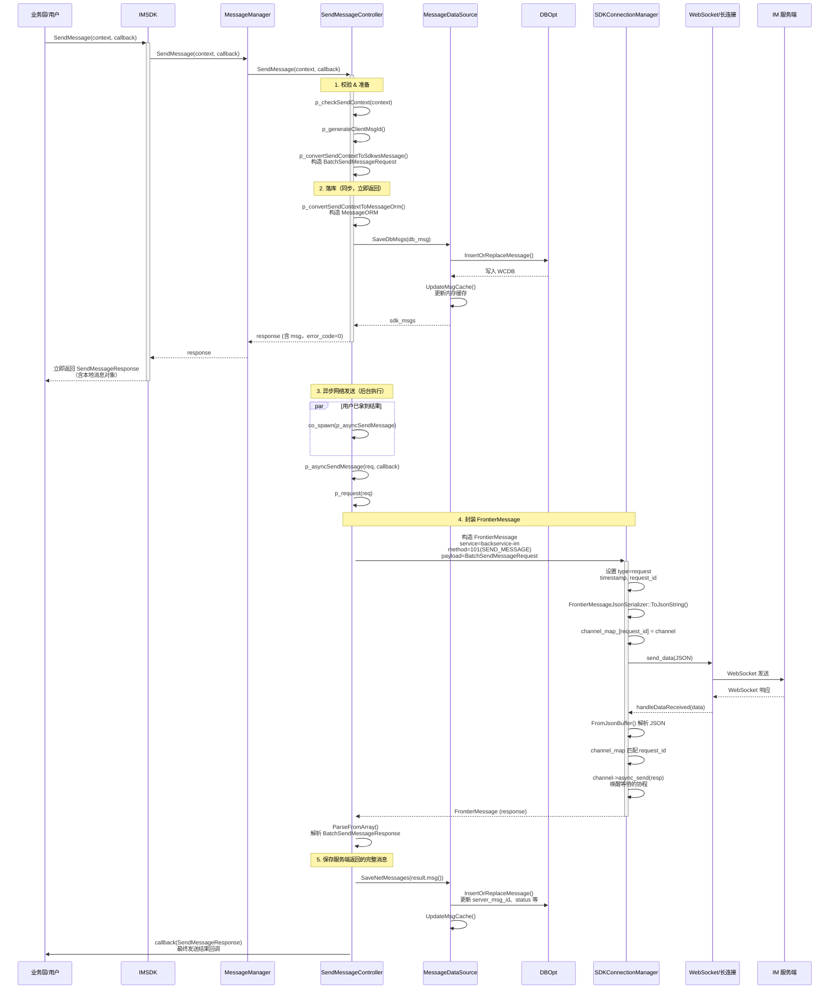

# ROC-IM-SDK 消息发送链路说明

## 一、时序图



---

## 二、关键环节说明

### 2.1 调用入口

| 层级 | 类 | 方法 | 说明 |
|------|-----|------|------|
| 业务层 | IMSDK | `SendMessage(context, callback)` | 对外 API，接收 `SendMsgContext` 和回调 |
| 管理层 | MessageManager | `SendMessage(...)` | 转发给 SendMessageController |
| 执行层 | SendMessageController | `SendMessage(...)` | 负责完整发送流程编排 |

### 2.2 同步路径（用户感知的“发送中”）

1. **参数校验**：`p_checkSendContext()` 检查 `content`、`conv_id`、`to_user_id` 等。
2. **生成 client_msg_id**：通过 UUID 生成，用于本地与服务端唯一标识。
3. **构造网络请求**：`BatchSendMessageRequest`，包含 `MessageData`（sendID、recvID、convID、content、sendTime 等）。
4. **先落库再返回**：
   - `p_convertSendContextToMessageOrm()` 构造 `MessageORM`（含 `client_order_index`）。
   - `MessageDataSource::SaveDbMsgs()` → `DBOpt::InsertOrReplaceMessage()` 写入 WCDB。
   - `UpdateMsgCache()` 更新内存缓存。
5. **立即返回**：`SendMessageResponse` 包含 `msg`（MessageModel）、`error_code=0`，用户可马上展示“发送中”状态。

### 2.3 异步路径（后台真实发送）

1. **协程调度**：`co_spawn(net_io_context, p_asyncSendMessage)`，在 `net_io_context` 上执行，不阻塞主流程。
2. **封装网关协议**：
   - `FrontierMessage`：`service=backservice-im`，`method=101`（SEND_MESSAGE），`payload` 为序列化后的 `BatchSendMessageRequest`。
3. **连接层发送**：
   - `SDKConnectionManager::SendRequest()` 设置 `type=request`、`timestamp`、`request_id`。
   - 序列化为 JSON 后通过 `LongConnectionClient::send_data()` 发送。
   - 通过 `channel_map_[request_id]` 与响应做匹配，`channel->async_receive()` 等待响应。
4. **响应处理**：
   - 收到数据后 `handleDataReceived()` 解析 JSON → `FrontierMessage`。
   - 若有 `request_id` 对应 channel，则唤醒等待协程；否则作为 Push 分发。
5. **解析响应**：`BatchSendMessageResponse` 内含 `SendMessageResult`（errorCode、errorMsg、msg）。
6. **更新本地**：`SaveNetMessages(result.msg())` 用服务端返回的完整 `MessageData` 覆盖/更新本地记录（含 `server_msg_id`、`status` 等）。
7. **回调业务**：`callback(SendMessageResponse)` 告知最终发送结果（成功/失败及完整消息）。

### 2.4 数据流与职责

```
SendMsgContext (业务输入)
    ↓
MessageData (BatchSendMessageRequest.msgs)  ← 网络协议
    ↓
MessageORM (DB 模型)  ← 持久化
    ↓
MessageModel (SDK 对外)  ← 业务使用
```

| 组件 | 职责 |
|------|------|
| SendMessageController | 编排发送流程、生成 client_msg_id、构造请求、处理响应 |
| MessageDataSource | 落库、缓存、消息区间维护 |
| DBOpt | WCDB 读写、顺序索引 |
| Convert | MessageORM ↔ MessageData ↔ MessageModel 转换 |
| SDKConnectionManager | WebSocket 连接、请求/响应匹配、Push 分发 |
| FrontierMessage | 网关层统一消息格式（JSON + payload） |

### 2.5 设计要点

1. **先写后发**：消息先落本地 DB，再异步发往服务端，保证弱网下“发送中”状态可展示。
2. **双线程**：同步路径在 `sdk_io_context`，网络发送在 `net_io_context`，避免阻塞 UI。
3. **request_id 匹配**：每个请求分配 `request_id`，响应通过 `channel_map` 精确匹配，支持并发请求。
4. **两次落库**：第一次为“发送中”状态；第二次用服务端返回的完整消息更新（含 server_msg_id、status 等）。

---

## 三、相关文件索引

| 文件路径 | 说明 |
|----------|------|
| `imsdk/src/wapper/IMSDK.cc` | 入口 `SendMessage` |
| `imsdk/src/core/message/MessageManager.cc` | 转发到 SendMessageController |
| `imsdk/src/core/message/private/send/SendMessage.cc` | 发送逻辑核心 |
| `imsdk/src/core/message/private/data_source/MessageDataSource.cc` | 落库与缓存 |
| `imsdk/src/core/network/connection/SDKConnectionManager.cc` | 网络发送与响应 |
| `imsdk/src/core/network/proto/sdkws.pb.h` | BatchSendMessageRequest/Response 定义 |
| `sdkws.proto` | 消息协议定义 |
